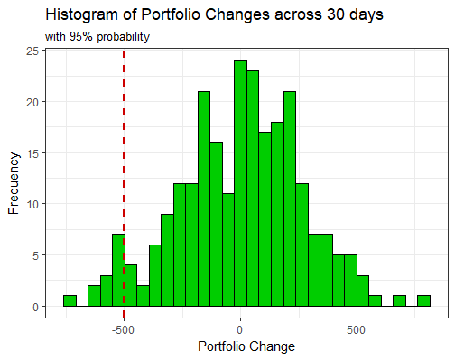

# Historical Simulation

Historical simulation method for estimating the Value at Risk (VaR) of a portfolio. This function
currently performs a VaR estimation for a portfolio of European call options.

Example of part of the output. A histogram showing the call options portfolio's distribution
of changes over the given time period.
